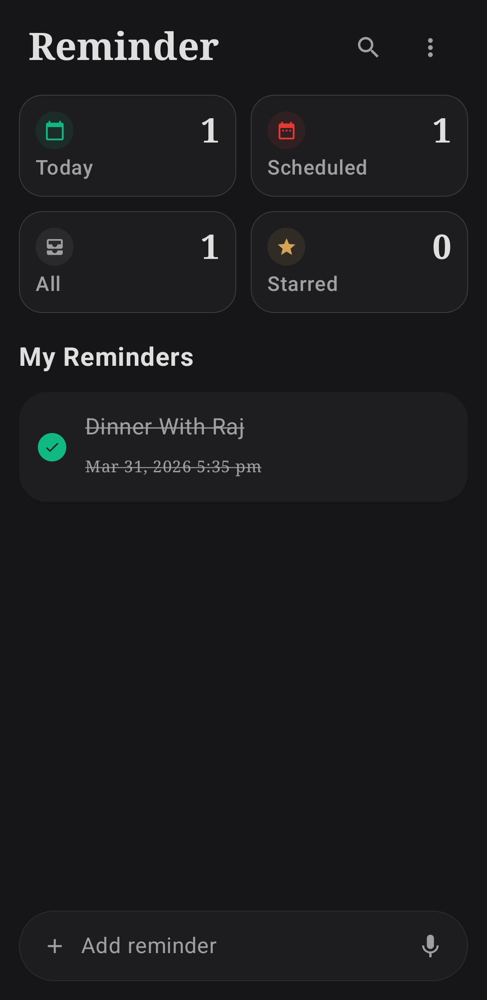
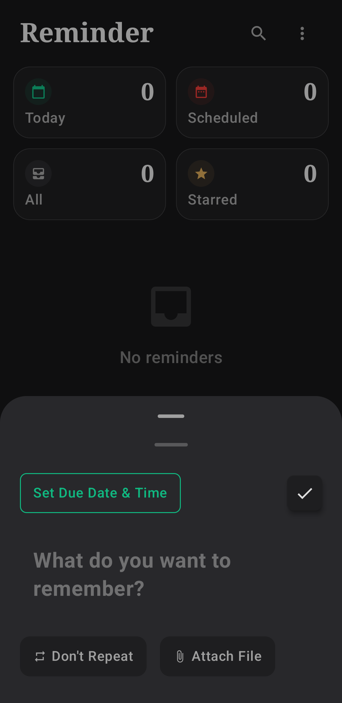
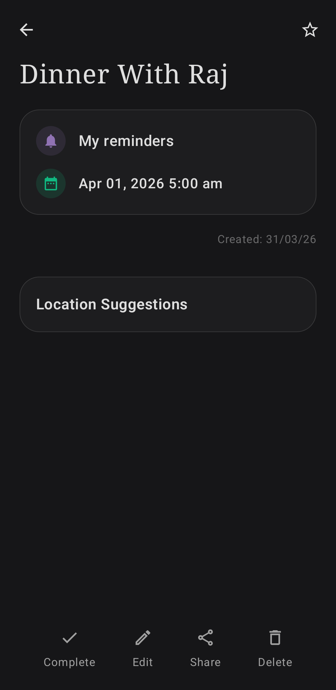
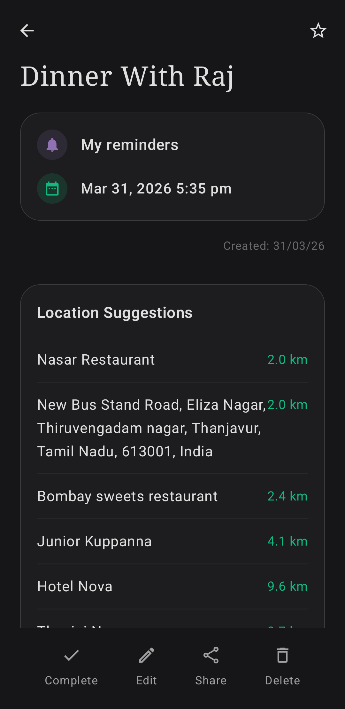
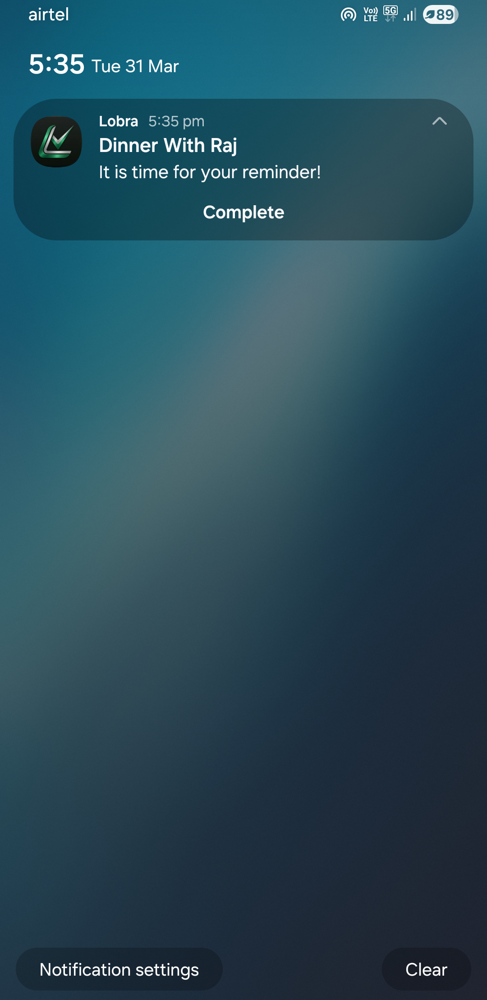
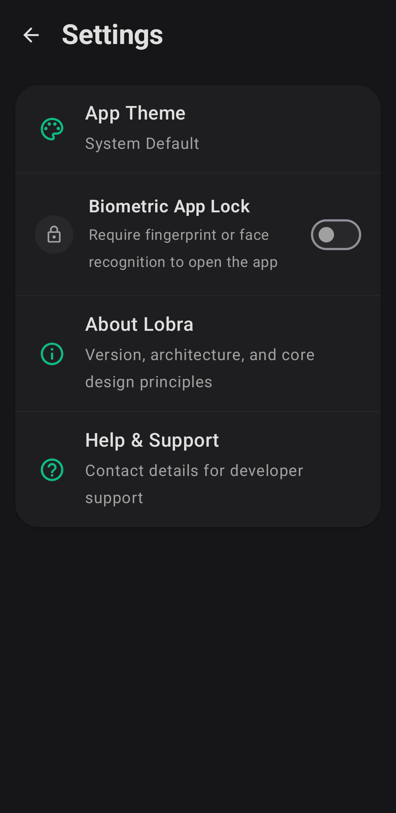
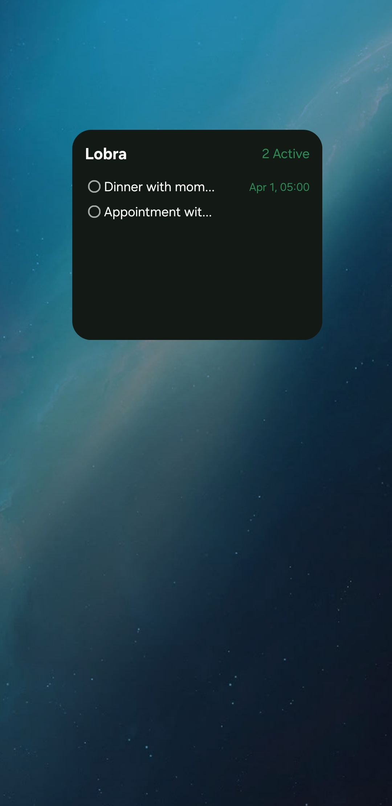
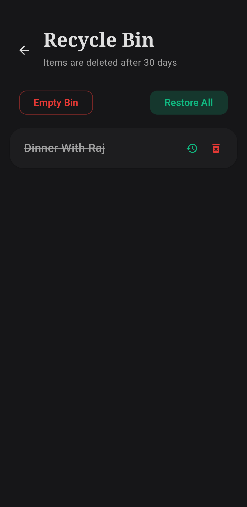

# Lobra


<p align="center">
  <b>A dark-mode-first, location-aware reminder application built with modern Android architecture.</b>
</p>

---

## Overview

Lobra is a reminder application designed to handle both time-based and location-based alerts with reliability and clarity. It enables users to create reminders that trigger not only at a specific time, but also based on real-world location context.

The project demonstrates modern Android development using Kotlin, Jetpack Compose, and an MVVM-based architecture, with a focus on clean structure and scalable design.

---

## Why Lobra?

Most reminder applications focus only on time-based alerts. Lobra extends this by integrating location-aware triggers, enabling contextual use cases such as:

* Reminders when arriving at a location
* Alerts based on movement or presence

The goal was to build a lightweight, offline-first system that remains reliable under Android background execution constraints.

---

## Demo

A complete walkthrough of the application, including permission handling, reminder creation, and notification triggering:

[Watch Demo Video](https://youtu.be/kEPup7qUp_g)

---

## Download APK

You can download and test the latest version of Lobra:

[Download APK](https://github.com/tshivaneshk/lobra-android/releases)

---

## Features

* Dark-mode-first interface for reduced eye strain
* Time-based and location-based reminders
* Full-screen alerts for high-priority notifications
* Biometric authentication for secure access
* Home screen widget using Jetpack Glance
* Offline-first storage using Room Database
* Scalable architecture with future backend support

---

## Challenges & Solutions

### Reliable Background Execution

Handling reminders when the app is killed or the device is idle requires careful system integration.

**Solution:**
Implemented system-level scheduling to ensure reminders trigger reliably even under Doze mode and background restrictions.

---

### Location Accuracy vs Battery Usage

Frequent updates improve accuracy but increase battery consumption.

**Solution:**
Optimized Google Play Services Location requests with balanced intervals and fallback handling.

---

### Full-Screen Notification Handling

Ensuring visibility of critical reminders even when the device is locked.

**Solution:**
Used a dedicated full-screen activity triggered via notifications.

---

### State Management in Compose

Maintaining consistent UI across lifecycle changes.

**Solution:**
Adopted MVVM with ViewModels to separate UI state from business logic.

---

## Screenshots

### Dashboard



### Add Reminder



### Reminder Details



### Location Suggestions



### Notification



### Settings



### Widget



### Recycle Bin



---

## Tech Stack

* **Language:** Kotlin
* **UI:** Jetpack Compose (Material 3)
* **Architecture:** MVVM
* **Database:** Room (KSP)
* **Networking:** Retrofit, Gson
* **Widgets:** Jetpack Glance
* **Location Services:** Google Play Services Location
* **Security:** AndroidX Biometric
* **Image Loading:** Coil
* **Navigation:** Navigation Compose

---

## Getting Started

### Prerequisites

* Android Studio (latest stable version recommended)
* Android SDK installed

### Installation

```bash
git clone https://github.com/tshivaneshk/lobra-android.git
```

1. Open the project in Android Studio
2. Sync Gradle
3. Run on an emulator or physical device

---

## Project Structure

```
app/src/main/java/com/example/lobra

├── MainActivity.kt
├── FullScreenReminderActivity.kt
├── NotificationReceiver.kt
├── ui/
├── data/
├── network/
├── viewmodel/
├── theme/
├── widget/
```

---

## Design Notes

The application follows a consistent dark color palette focused on readability and minimal visual noise. The interface is designed to prioritize quick interaction and clear presentation of reminders.

---

## Roadmap

* Cloud synchronization and user accounts
* Enhanced customization for reminders
* Background performance optimizations
* Improved widget interactivity

---

## Author

T Shivanesh Kumar

---

## License

This project is licensed under the MIT License.
